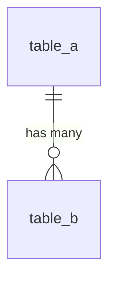
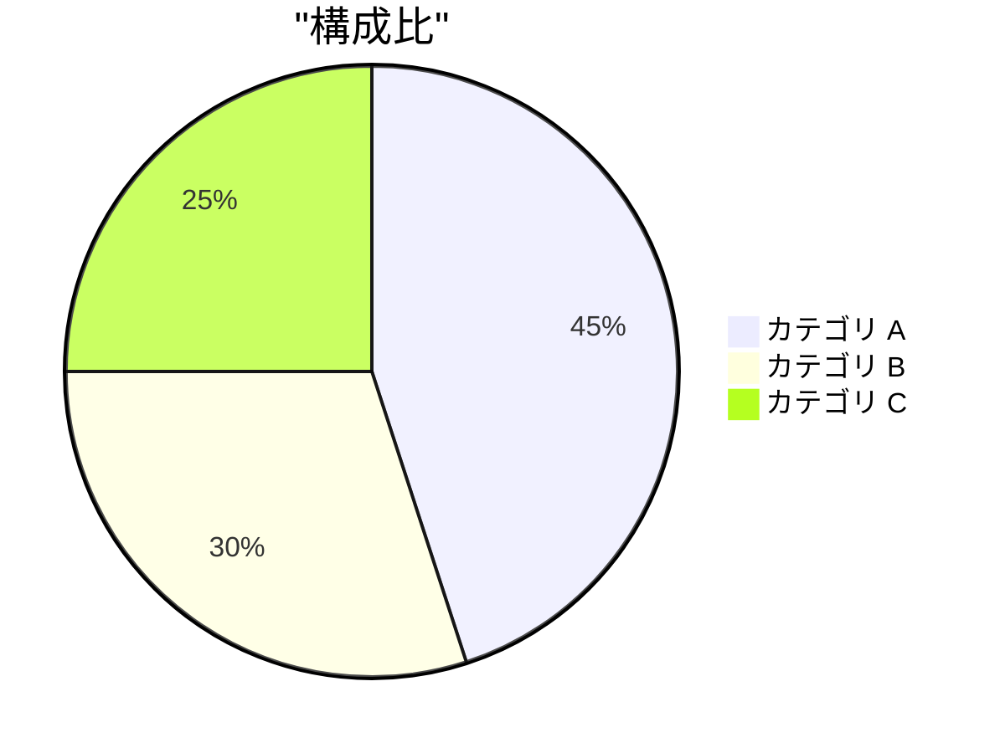

# [分析タイトル]

> `[...]` はプレースホルダー。実際の値に置き換えること。

## 1. 背景と目的

[分析の背景と目的の概要]

### 1.1 背景

[なぜこの分析が必要になったか、ビジネス上の文脈]

### 1.2 目的

- 何を知りたいか
- 誰がどう使うか (意思決定、施策設計、モニタリングなど)
- 一度きりの分析か、継続的に見たいか

## 2. データセット

[データセットの概要。データの同期元、同期の最大遅延など]

**参考 URL**

- [スキーマ情報、SLO ソースなどの参考 URL]

### 2.1 利用データセット

| プロジェクト | データセット | テーブル | 用途 |
|------------|------------|---------|-----|
| ... | ... | ... | ... |

### 2.2 テーブル間の関係



## 3. クエリ設計

[クエリ設計の概要]

### 3.1 設計方針

[クエリの構成、CTE の分割方針、パフォーマンス考慮点]

### 3.2 クエリ

```sql
...
```

### 3.3 実行結果

```text
...
```

## 4. 考察

[考察の概要]

### 4.1 結果の解釈

[データから読み取れること]

<!-- テーブルでの比較や集計例 -->
| 項目 | 値 | 前期比 |
|-----|---|-------|
| ... | ... | ... |

<!-- Mermaid での可視化例 -->


### 4.2 制約・注意点

[データの制約、重複カウントの可能性、除外したデータなど]
