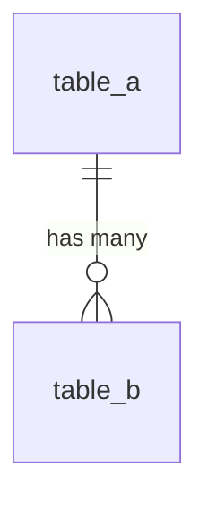

# [レポート名] 設計

> `[...]` はプレースホルダー。実際の値に置き換えること。

## 1. 概要

[レポートの概要]

### 1.1 レポートの目的

[何を継続的にモニタリングするか]

### 1.2 想定される意思決定

- [このレポートを見てどんな判断をするか]

## 2. データセット

[データセットの概要。データの同期元、同期の最大遅延など]

**参考 URL**

- [スキーマ情報、SLO ソースなどの参考 URL]

### 2.1 利用データセット

| プロジェクト | データセット | テーブル | 用途 |
|------------|------------|---------|-----|
| ... | ... | ... | ... |

### 2.2 テーブル間の関係



## 3. 主な指標とディメンション

[主な指標とディメンションの概要]

### 3.1 [指標/ディメンション名]

[定義、計算方法、取得元などの説明]

| 項目 | 値 |
|-----|-----|
| 種類 | [指標/ディメンション] |
| フィールド | [フィールド名] |
| 単位 | [単位] |

## 4. データソース

[データソース設定の概要]

| データソース名 | 粒度 | 用途 |
|--------------|------|------|
| [データソース名] | [日次/月次] | [用途] |

### 4.1 [データソース名]

[データソースの目的、設計上の考慮事項など]

| 設定項目 | 値 |
|---------|-----|
| コネクタ | BigQuery |
| 接続方法 | カスタムクエリ |
| [日付フィールド名] のデータ型 | 日付 |

**パラメータ:** (任意)

| パラメータ名 | データ型 | デフォルト値 | 説明 |
|------------|---------|------------|------|
| [パラメータ名] | 数値 | [デフォルト値] | [説明] |

**クエリ:**

```sql
SELECT
  DATE_TRUNC(date, MONTH) AS [日付フィールド名],
  SUM([値フィールド]) AS [集計フィールド名]
FROM `[project].[dataset].[table]`
GROUP BY [日付フィールド名]
```

**フィールド定義:**

型は Looker Studio のデータ型を使用する (日付と時刻, テキスト, 数値, 通貨 (JPY), パーセント 等)。

| フィールド | 型 | 説明 |
|-----------|-----|-----|
| [日付フィールド名] | 日付と時刻 | [例: 集計月] |
| [集計フィールド名] | 数値 | [例: 合計値] |

## 5. ページ

[ページ設定の概要]

| ページ | 目的 |
|-------|-----|
| [ページ名] | [ページの目的] |

### 5.1 [ページ名]

**レイアウト:**

```text
┌─────────────────────────────────────────┐
│ [レポートタイトル]                         │
├──────────────┬──────────────────────────┤
│ [スコアカード] │ [スコアカード]            │
├─────────────────────────────────────────┤
│ [グラフ]                                 │
└─────────────────────────────────────────┘
```

**[スコアカード名]**

| 設定項目 | 値 |
|---------|-----|
| グラフの種類 | スコアカード |
| データソース | [データソース名] |
| 指標 | [フィールド名] |
| 集計方法 | SUM |

[このスコアカードの目的・表示内容の説明]

**[グラフ名]**

| 設定項目 | 値 |
|---------|-----|
| グラフの種類 | [期間グラフ/積み上げ複合グラフ/表 等] |
| データソース | [データソース名] |
| ディメンション | [フィールド名] |
| 指標 | [フィールド名] (集計: SUM) |
| 並べ替え | [フィールド名] [昇順/降順] |

[このグラフの目的・表示内容の説明]

## 6. 共有設定

[共有設定の概要]

| 権限 | 付与先 |
|-----|-------|
| 閲覧 | [Google Group または個人のメールアドレス] |
| 編集 | [Google Group または個人のメールアドレス] |
